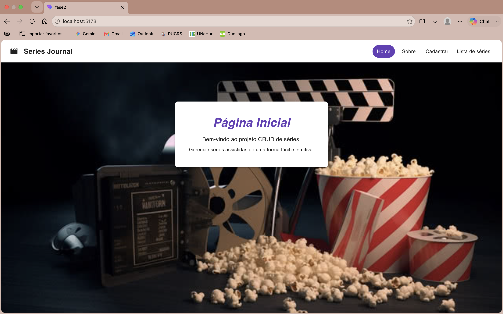
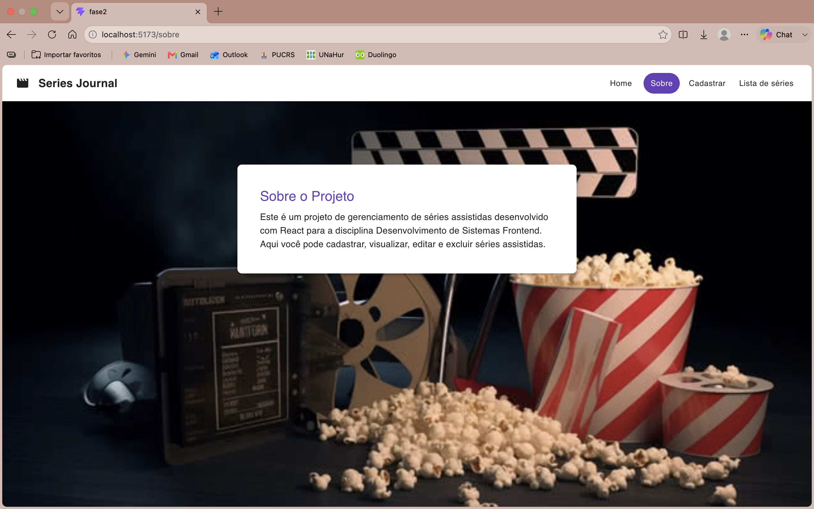
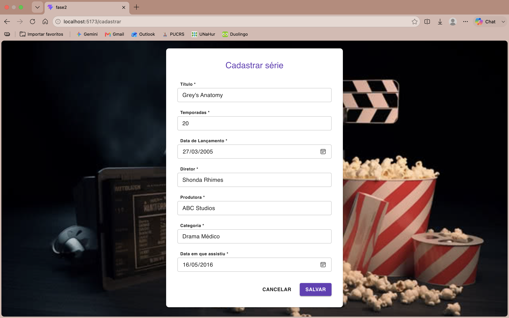
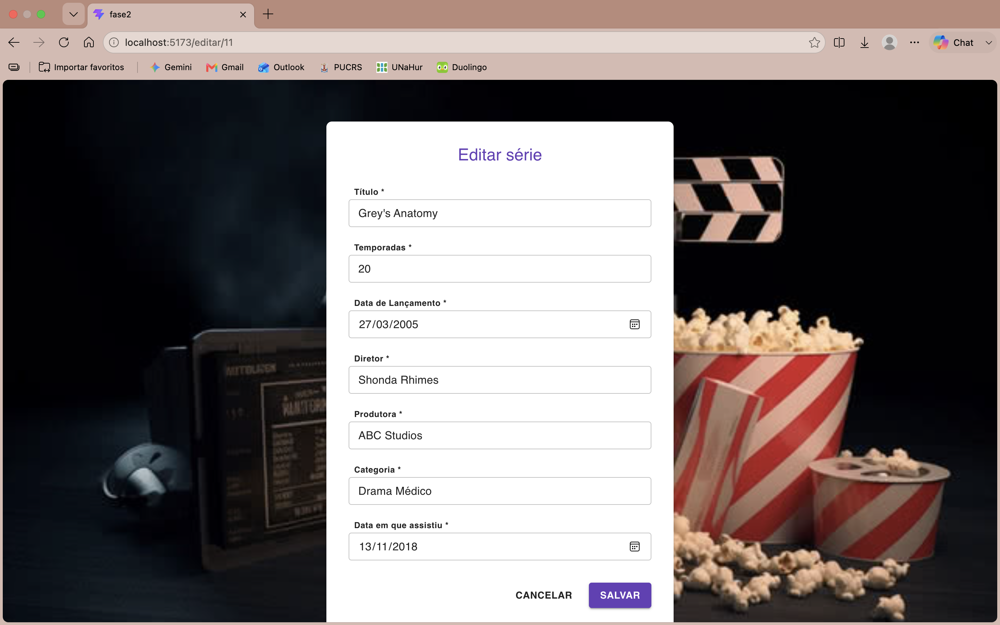

**Serie Journal - Aplicação Front-End**
Projeto desenvolvido no 2º semestre do curso de ADS na PUCRS, na disciplina de Desenvolvimento Front-End. O "Serie Journal" é uma aplicação web para registro e gerenciamento de um catálogo de séries.
O objetivo principal deste projeto foi construir uma interface de usuário dinâmica e integrá-la a uma API REST pré-existente.

**Estrutura do Projeto**
O repositório está dividido em duas pastas principais para facilitar a execução local:
1. frontend (Meu Desenvolvimento): Interface do usuário construída do zero com React e Vite. Focada na estilização, criação de componentes e integração de endpoints utilizando a biblioteca Axios para operações CRUD (GET, POST, PUT e DELETE).
2. backend (API Fornecida): API REST construída em Node.js com Express, fornecida pelos professores da disciplina. A pasta inclui a base de dados (series.json) e uma collection do Postman para testar as rotas.

**Tecnologias Utilizadas no Desenvolvimento**
Front-end: React, Vite, Axios, CSS.
Ferramentas: Postman, NPM.

**Pré-requisitos e Execução**
Para rodar a aplicação localmente, é necessário ter o Node.js instalado. A execução exige que o Back-end fornecido e o Front-end estejam rodando simultaneamente em terminais separados.

1. Iniciando a API (Back-end)
Abra o terminal e navegue até a pasta da API: cd backend
Instale as dependências: npm install
Inicie o servidor local: npm start

2. Iniciando a Interface (Front-end)
Abra um novo terminal e navegue até a pasta da interface: cd frontend
Instale as dependências do React: npm install
Inicie a aplicação no modo de desenvolvimento: npm run dev
Após iniciar o front-end, o terminal fornecerá um link local (geralmente http://localhost:5173) para acessar a aplicação no navegador.

## Telas da Aplicação

**Página Inicial**

**Sobre o Projeto**

**Cadastrar Série**

**Editar Série**

**Autoria:**
Front-end e Integração: Desenvolvido por Caroline Toth Leite.
Back-end/API: Fornecido pela equipe docente da PUCRS.
